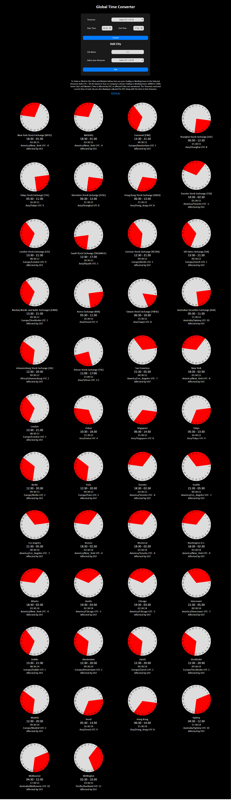

# Global Time Convertor

**This readme was written by and the other one was optimized by ChatGPT**

I think I am not wrong to say that every one wants a Remote Job.

I also wanted one I spent time day dreaming about but while dreaming about it was a bit hard to calculate the working hours for different cities (I contemplated many possible scenarios).

So I built this.

So there is a form where you will have to add your details.

First you have to select the Timezone you are in. I am from India so default selection is India.
As you change it will show you the updated time below immediately.

Why you can't select a city, country or a region cause it there are about 38 Timezones and thousands cities and 200 or so countries so everyone who is going to use can figure out the Timezone you are in.

Then select the working hour of you company.
I thought the most common working hours would be 0900 to 1700 so these are the default values.
As you change it will show you the updated time below immediately.

I have added all the cities which ChatGPT thinks hire Remote Developers about 24 of them.

But you can also add custom cities as well.

how to add cities

enter city name & select the timezone and press the Add City Button

And I have made it such that when you add a new city it will be added in at the start.

So below form there is some text repeating the same information in a written way and below it there is Github Link for the project.

So now the main part.

I have created Analog Clocks on which the Working or Trading Hours are shown in a Red Colored Sector.
It took me about to week to create the component.

And below that there is the name of the place the Working or Trading Hours in Text then the current time at that place then the Timezone Name / Region and the hours it is Ahead or Behind UTC or GMT.

Then finally there was a problem too big to solve.

Most of the western nations follow Day Light Savings.

Means the Time goes Forward and Backward 1 Hours once a year and the day it happens is different for each city or region every year.

I had wasted a lot of time to make the Analog Clock it would take too much time to fix this issue so that is why it is there and maybe I will fix it future.

So depending upon the time of the year you are using this you can add an hour in the time given by this website.

and at last I have mentioned which cities are affected by DST.

so that's it.

update 04 July 2024

using chat gpt I figured out a solution to solve this issue and you get time adjusted to DST of the cities or market affected by it.
I used the Moment-Timezone Package.

here is the function

```js
function convertTimeToCity(myTimezone, time, targetTimeZoneString) {
  let localTime = moment.tz(time, "HH:mm", myTimezone);
  let convertedTime = localTime.clone().tz(targetTimeZoneString);

  return convertedTime.format("HH:mm");
}
```

Feel free to make a pull request.

At last while explain to a few friends what I have made I got the idea that this can be used by trader as well to know the time at which they can trade from India (their Timezone) to another stock market e.g. NYSE, NASDAQ, etc.

So I have added all the stock markets which were mentioned in the [Wikipedia Article](https://en.wikipedia.org/wiki/List_of_major_stock_exchanges).

I think in some time I will create an NPM Package for the analog clock so you can also create the sectors to show the time taken visually.

The project has MIT License.

## Website Preview



## Current Issues (There is only 1)

When you start go nuts while calculating the working and input the working hours of a slave more then 10 Hours the analog clock starts to break and stops showing the sector but the time is still visible in Textual form. And Traders don't need to worry about it cause their working hours are set according to the Market Time from the Wikipedia Article.
